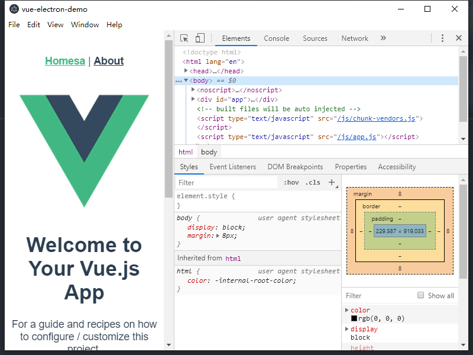
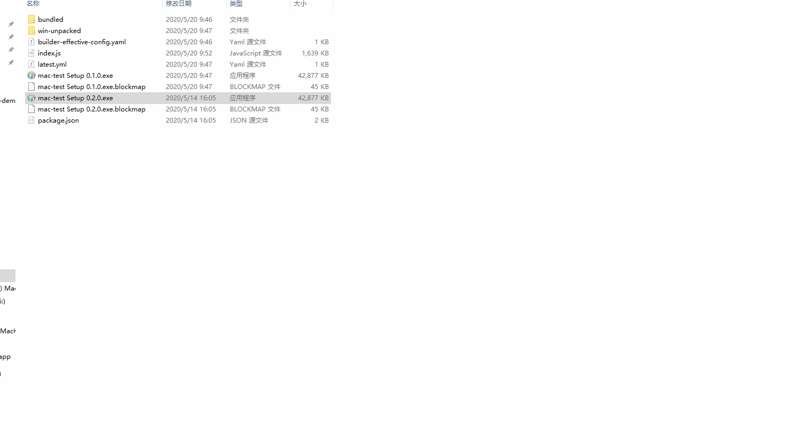

# Electron vue 集成

Electron = Node.js + Chromium + Native API

## Electron 组成

`Electron = Node.js + Chromium + Native API`

1. Node 提供 es 运行环境
2. Chromium 提供 HTML、CSS、DOM 等 web 相关技术
3. Native API 平台特性

既然 Electron 提供了这三种环境是不是就意味着在 Electron 里写的 js，都可以使用上述三个环境的各种 api 嘛？当然不是，如果是这样，就会造成混乱，electron 同样采用了浏览器的多进程架构，一个主进程，多个渲染进程

## 主进程 main-process

主进程作用

- 渲染进程管理（创建/切换/销毁），表现即为窗口的创建，销毁
- 应用生命周期管理
- 主进程，渲染进程通信
- 自动更新
- 工具条菜单栏注册

## 渲染进程 renderer-process

界面交互相关的，具体的业务功能，都由 renderer 进程来做，和平时开发 web 项目一致。

渲染进程之间是相互独立，不会共享内存和状态的。如果把主进程理解为浏览器，那么渲染进程就相遇与浏览器中的 Tab 页面，每个页面都是独立的，不能共享状态。比如 tab1 网页中的 window 上挂在一个 window.a,但在 tab2 中的 window 上你并不会获得 window.a 这个变量，因为他们在不同的进程里。这样的一个好处就是，一个 Tab 死掉了，并不会影响另一个网页的内容，也并不会卡死浏览器。
在 electron 中的场景大致就是一下这些

- 一个渲染进程死了，另一个渲染进程页不会死，照常运行
- 一个渲染进程死了，主进程不会卡死，还是可以开启其他窗口
- 一个渲染进程页死了，渲染进程也会死

## 体验 electron

官网有一个简单的仓库，我们直接下载下来尝试

```bash
# Clone this repository
git clone https://github.com/electron/electron-quick-start
# Go into the repository
cd electron-quick-start
# Install dependencies
npm install
# Run the app
npm start
```

结果很不幸的在 install 安装依赖的时候 命令行卡在 node install.js，这个文件是要从国外网络下载 electron.zip
导致下载不下来

::: tip
npm 下载的包有两种类型，一种是就是 npm 上的 js 包直接就下完了，还有一种是 npm 包里去下载另外的开源软件，例如 node-sass, electron
这种即便使用 npm 淘宝镜像也是下载不下来的，必要的时候还是要科学上网的。
:::

## 解决方法

1. 前往淘宝镜像
   https://npm.taobao.org/mirrors/electron/8.3.0/
   手动下载对应的包，我用 windows，所以下载 electron-v8.3.0-win32-x64.zip
   然后在 node_modules\electron\下创建 dist 文件夹。
   将下载的压缩包解压进刚刚创建的 dist。
   在 node_modules\electron\中创建 path.txt，内容为 electron.exe（对应自己的平台，不同平台不一样）

这每次都要这样干也太麻烦了，

2. 设置开源镜像软件代理，在 package.json 同目录下新建 .npmrc 文件，内容为 electron_mirror=https://npm.taobao.org/mirrors/electron/

3. 删除 node_modules 重新执行 npm i,下载依赖，成功后执 npm run start

## electron 集成 vue 方案对比

1. electron-vue

2. vue-cli-plugin-electron-builder

## electron-vue

electron-vue 是 vue-cli2.0 的版本，现在 cli 的最新版本已经是都已经出到 4.3.1 了，再者 electron-vue 中间断更了很久我看了下提交记录有长达一年半的时间没有更新任何内容。不过这个集成方案里面用到的技术还是很有参考意义，并且使用这个方案也是能做出产品的。

## vue-cli-plugin-electron-builder

vue-cli-plugin-electron-builder 是 cli 插件市场中的 electron 集成方案，项目结构也比较清晰，基本和 vue 项目保持一致。

并且集成了开发环境与生产环境，打包使用的也是主流的 electron-builder 方案。

> complete solution to package and build a ready for distribution Electron, Proton Native or Muon app for macOS, Windows and Linux with “auto update” support out of the box.

简单的说，electron-builder 就是有比 electron-packager 有更丰富的的功能，支持更多的平台，同时也支持了自动更新。除了这几点之外，由 electron-builder 打出的包更为轻量，并且可以打包出不暴露源码的 setup 安装程序。

## 实战 demo

接下来的部分是对 vue 和 electron 开发的 demo。个人写文档都是采用 md 文件来记录，奈何公司 confluence 不支持 md 格式文件导入。
那就开发一个 md 格式文件转成公司 confluence 支持的格式。麻雀虽小，五脏俱全，包含，开发，默认打包，以及安装软件问题等。

先把需要的环境配好

```bash
npm config set sass_binary_site=https://npm.taobao.org/mirrors/node-sass
npm config set electron_mirror=https://npm.taobao.org/mirrors/electron/
npm config set  phantomjs_cdnurl=http://cnpmjs.org/downloads
npm config set  electron_mirror=https://npm.taobao.org/mirrors/electron/
npm config set  chromedriver_cdnurl=https://npm.taobao.org/mirrors/chromedriver
```

把这些可能用到的开源软件包先配上代理

```bash
vue create vue-electron-demo
```

和平常 vue 开发一样，选择自己需要的选项，

```bash
├─.browserslistrc
├─.eslintrc.js
├─.gitignore
├─babel.config.js
├─package-lock.json
├─package.json
├─public
│ ├─favicon.ico
│ └─index.html
├─README.md
└─src
  ├─App.vue
  ├─assets
  │ └─logo.png
  ├─components
  │ └─HelloWorld.vue
  ├─main.js
  ├─router
  │ └─index.js
  ├─store
  │ └─index.js
  └─views
    ├─About.vue
    └─Home.vue

```

随后添加 vue-cli-plugin-electron-builder

```bash

vue add vue-cli-plugin-electron-builder
```

接下来等待安装成功即可

安装完成后，目录会发生改变

```bash

├─.browserslistrc
├─.eslintrc.js
├─.gitignore
├─.npmrc
├─babel.config.js
├─package-lock.json
├─package.json
├─public
│ ├─favicon.ico
│ └─index.html
├─README.md
└─src
  ├─App.vue
  ├─assets
  │ └─logo.png
  ├─background.js    //多的主进程入口文件
  ├─components
  │ └─HelloWorld.vue
  ├─main.js
  ├─router
  │ └─index.js
  ├─store
  │ └─index.js
  └─views
    ├─About.vue
    └─Home.vue

```

其中 package.json 中会 多几条 script 脚本

```json
{
  "scripts": {
    "serve": "vue-cli-service serve",
    "build": "vue-cli-service build",
    "lint": "vue-cli-service lint",
    "electron:build": "vue-cli-service electron:build",
    "electron:serve": "vue-cli-service electron:serve",
    "postinstall": "electron-builder install-app-deps",
    "postuninstall": "electron-builder install-app-deps"
  }
}
```

我们执行 npm run electron:server，等待片刻

打开如下界面表示启动成功



先测试下打包

执行 `npm run electron:build`

控制台会输出打包过程信息

```bash
 INFO  Building app with electron-builder:
  • electron-builder  version=21.2.0 os=10.0.18363
  • description is missed in the package.json  appPackageFile=E:\electron\vue-electron-demo\dist_electron\bundled\package.json
  • author is missed in the package.json  appPackageFile=E:\electron\vue-electron-demo\dist_electron\bundled\package.json
  • writing effective config  file=dist_electron\builder-effective-config.yaml
  • packaging       platform=win32 arch=x64 electron=6.1.12 appOutDir=dist_electron\win-unpacked
  • default Electron icon is used  reason=application icon is not set
  • downloading     url=https://github.com/electron-userland/electron-builder-binaries/releases/download/winCodeSign-2.5.0/winCodeSign-2.5.0.7z size=5.6 MB parts=1

```

可以看到在打包的时候会去 github 官网上下载 winCodeSign 软件包，直接从 GitHub 上下载出现的问题就是一直卡在下载过程然后失败。最简单的方法就是科学上网，另外就是想办法从 github 上把软件包下载下来放在本地。

上述问题解决后，继续打包

```bash

 INFO  Building app with electron-builder:
  • electron-builder  version=21.2.0 os=10.0.18363
  • description is missed in the package.json  appPackageFile=E:\electron\vue-electron-demo\dist_electron\bundled\package.json
  • author is missed in the package.json  appPackageFile=E:\electron\vue-electron-demo\dist_electron\bundled\package.json
  • writing effective config  file=dist_electron\builder-effective-config.yaml
  • packaging       platform=win32 arch=x64 electron=6.1.12 appOutDir=dist_electron\win-unpacked
  • default Electron icon is used  reason=application icon is not set
  • building        target=nsis file=dist_electron\vue-electron-demo Setup 0.1.0.exe archs=x64 oneClick=true perMachine=false
  • building block map  blockMapFile=dist_electron\vue-electron-demo Setup 0.1.0.exe.blockmap
 DONE  Build complete!

```

当看到 DONE Build complete!表示打包成功

```bash

├─.browserslistrc
├─.eslintrc.js
├─.gitignore
├─.npmrc
├─babel.config.js
├─dist_electron   //打包后生成的文件夹
│ ├─builder-effective-config.yaml
│ ├─bundled
│ │ ├─background.js
│ │ ├─css
│ │ │ └─app.4aa4aa41.css
│ │ ├─favicon.ico
│ │ ├─img
│ │ │ └─logo.82b9c7a5.png
│ │ ├─index.html
│ │ ├─js
│ │ │ ├─about.d5b24448.js
│ │ │ ├─about.d5b24448.js.map
│ │ │ ├─app.a4a7a228.js
│ │ │ ├─app.a4a7a228.js.map
│ │ │ ├─chunk-vendors.284623cd.js
│ │ │ └─chunk-vendors.284623cd.js.map
│ │ ├─node_modules
│ │ └─package.json
│ ├─index.js
│ ├─package.json
│ ├─vue-electron-demo Setup 0.1.0.exe  //exe安装包
│ ├─vue-electron-demo Setup 0.1.0.exe.blockmap
│ └─win-unpacked    //免安装 绿色版

```

至此一个小流程就走完了

我尝试安装了下，直接给我安装到 c 盘了，原因是没有进行打包配置

接下来更改一下打包配置项。

```js
//vue-config.js
module.exports = {
  // ...
  pluginOptions: {
    electronBuilder: {
      builderOptions: {
        productName: "mac-test",
        appId: "mac-test.desktop",
        // win: {
        //   icon: "./public/favicon.ico"
        // },
        // mac: {
        //   icon: "./public/app.png"
        // }
        publish: [
          //这个是升级用的
          {
            provider: "generic",
            url: "http://127.0.0.1:80/", //这里是我本地开的服务器的地址
          },
        ],
        nsis: {
          oneClick: false, // 是否一键安装
          allowElevation: true, // 允许请求提升。 如果为false，则用户必须使用提升的权限重新启动安装程序。
          allowToChangeInstallationDirectory: true, // 允许修改安装目录
          // installerIcon: "./build/icons/aaa.ico", // 安装图标
          // uninstallerIcon: "./build/icons/bbb.ico", //卸载图标
          // installerHeaderIcon: "./build/icons/aaa.ico", // 安装时头部图标
          createDesktopShortcut: true, // 创建桌面图标
          createStartMenuShortcut: true, // 创建开始菜单图标
          shortcutName: "mac-test", // 图标名称
          // include: "build/script/installer.nsh" // 包含的自定义nsis脚本
        },
      },
    },
  },
};
```

打包后安装 exe 文件



## 代码设计与组织

```bash

├─.browserslistrc
├─.eslintrc.js
├─.gitignore
├─.npmrc
├─.prettierrc
├─.vscode
├─babel.config.js
├─debug.log
├─dist_electron
├─package-lock.json
├─package.json
├─public
├─README.md
├─src
│ ├─App.vue
│ ├─assets
│ │ └─logo.png
│ ├─background.js
│ ├─components
│ ├─main-process
│ │ ├─communication -------------- // 进程通信
│ │ │ └─ipc.js
│ │ ├─menus ---------------------- // 菜单管理
│ │ │ ├─config.js
│ │ │ └─create.js
│ │ ├─native-ui
│ │ │ ├─dialogs ------------------ // 弹框，保存打开文件
│ │ │ │ ├─error.js
│ │ │ │ ├─index.js
│ │ │ │ ├─information.js
│ │ │ │ ├─open-file.js
│ │ │ │ └─save.js
│ │ │ ├─drag
│ │ │ │ ├─codeIcon.png
│ │ │ │ └─drag.js
│ │ │ ├─notice ------------------- // 系统通知
│ │ │ │ └─index.js
│ │ │ └─tray --------------------- // 系统托盘
│ │ │   ├─iconTemplate.png
│ │ │   ├─iconTemplate@2x.png
│ │ │   ├─tray.js
│ │ │   └─windows-icon@2x.png
│ │ ├─shortcuts ------------------ // 全局快捷键
│ │ ├─system
│ │ ├─update
│ │ │ └─checkUpdate.js ----------- // 检测更新
│ │ └─windows
│ │   └─create-window.js --------- // 窗口管理
│ ├─main.js
│ ├─router
│ ├─store
│ ├─utils
│ └─views
├─vue.config.js
```

## 后续内容以及要解决的问题

1. electron 原生菜单的自定义，菜单事件，菜单自定义事件。以及渲染进程的菜单自定义，菜单绑定快捷键，全局快捷键 --耿艳
2. 进程间通信，交互包含选择本地文件上传，下载文件保存到本地。文件下载的默认位置配置项，类似微信，ipc 封装思路--辛柳
3. 多窗口的维护与管理。窗口的最大化，最小化，显示在最前面的窗口，系统托盘，托盘闪烁。 --李阿龙
4. electron-builder 方向打包。 --徐会忠
5. electron-updater 方向升级方案，全量，增量。实现方式，以及各种方案适用场景，优劣对比 --李惠荣
6. 调用 c++ dll 文件 --刘浩
7. 要有 demo git 链接，http://gitlab.idc.safecenter.cn/electron。放在这个组下，自己新建git仓库

electron-localshortcut
electron-store
