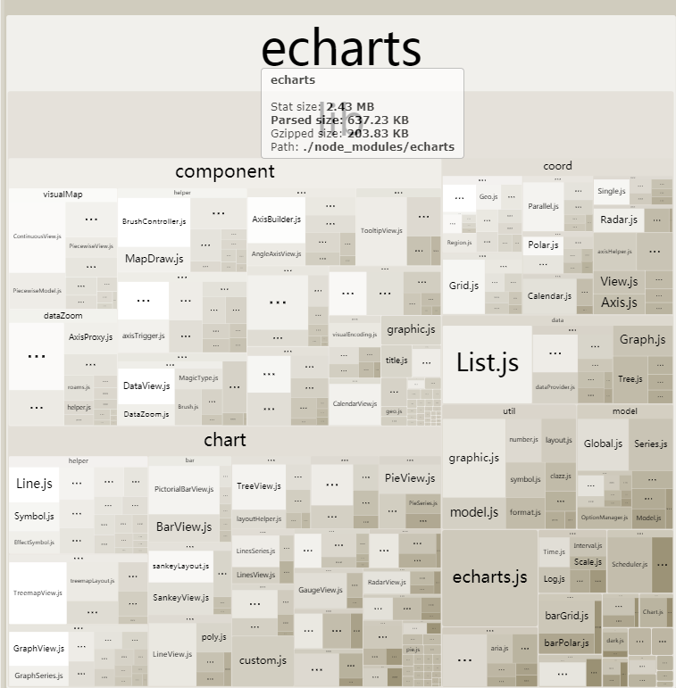
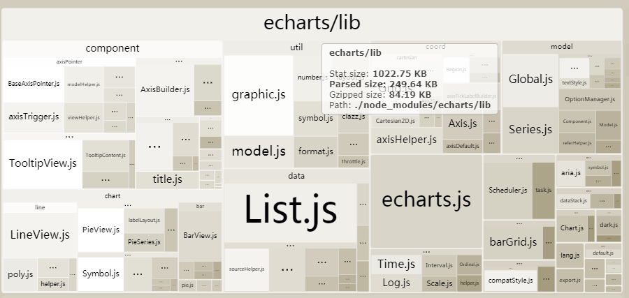

# echarts 图表库按需加载

最近这两周的时间一直在做图表可视化的开发，用的是 echarts 图标库，整个库压缩后依然有 600 多 kb，pc 上还好，到了移动端上自己写的代码才百十 k，一个图表库就 600 多 kb 了，于是决定采用按需加载的方式

## 按需加载 echarts 模块

当我们只需要 echarts 的 pie 和 bar 模块的时候，我们会这么写：

```javascript
import echarts from "echarts/lib/echarts";
import "echarts/lib/chart/pie";
import "echarts/lib/chart/bar";
```

这确实没什么问题，只是每次增加一个模块都要写一大堆路径，有点繁琐，于是 Google 一下 echarts 按需加载，提到一个 babel-plugin-equire npm 包

### 安装

```bash
npm i babel-plugin-equire -D

```

然后，在 babel.config.js 文件中添加该插件

```javascript
module.exports = {
  presets: ["@vue/app"],
  plugins: ["equire"]
};
```

### 使用

准备工作做完了，接下来要做的是按需加载了，新建一个 initEcharts.js (src/lib)下，引入需要加载的模块

```javascript
const echarts = equire([
  // 加载用到的模块
  "bar",
  "legend",
  "title",
  "line",
  "tooltip",
  "grid",
  "axisPointer",
  "pie"
]);
export default echarts;
```

接下来在 main.js 中更改引入路径

```javascript
//import echarts from "echarts"; //注释掉原来的，加载整个模块
import echarts from "./lib/initEcharts.js"; //引入定义好需要加载的模块
```

初次替换可能会报错，说缺少模块，主要是按需加载没写全，浏览器控制台会告诉你需要哪些模块，在定义处加上即可

## 体积减少了多少

按需加载已经做好了，这时候看看 echarts 体积减少了多少，打包后代码都被压缩放到一起了，不能查看每个库大小占比，这时候我们需要一个模块占比分析 webpack-bundle-analyzer ，打包库分析

### 安装库

我们需要打包分析库，以及跨平台的配置环境变量的库

```bash
npm i cross-env -D
npm i webpack-bundle-analyzer -D
```

### 配置 npm 脚本

```json
    "analyzer": "cross-env use_analyzer=true npm run build",
```

### 配置执行代码

```javascript
const autoprefixer = require("autoprefixer");
let BundleAnalyzerPlugin = require("webpack-bundle-analyzer")
  .BundleAnalyzerPlugin;

module.exports = {
  publicPath: "./",
  assetsDir: "android",
  indexPath: "index_android.html",
  productionSourceMap: false,
  configureWebpack: config => {
    if (process.env.use_analyzer) {
      config.plugins.push(new BundleAnalyzerPlugin());
    }
  }
};
```

随后会打开一个网页查看各个 npm 包的占比,
未使用按需加载时大小是这样有 637.23KB


按需加载后是这样 249.64KB



可见体积缩小了一半还多，对于移动端还是很值得这么做的。
