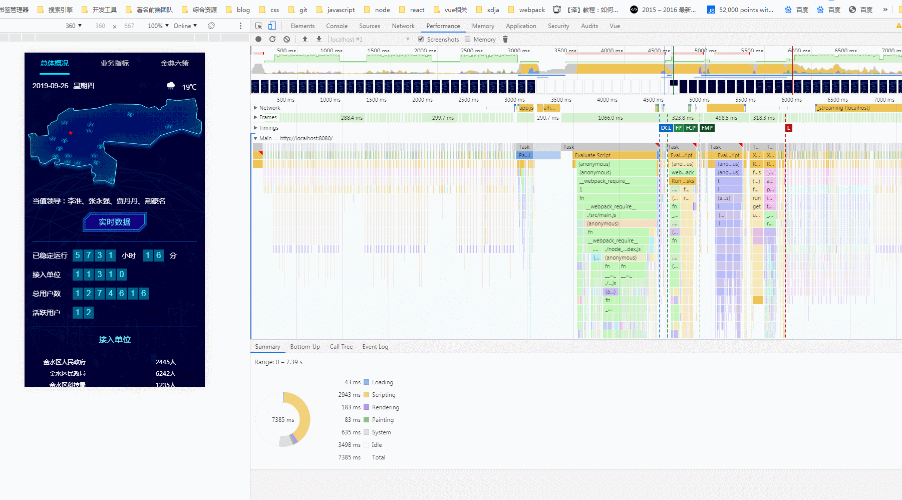
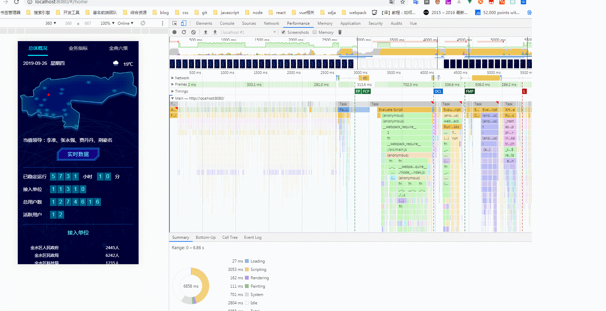
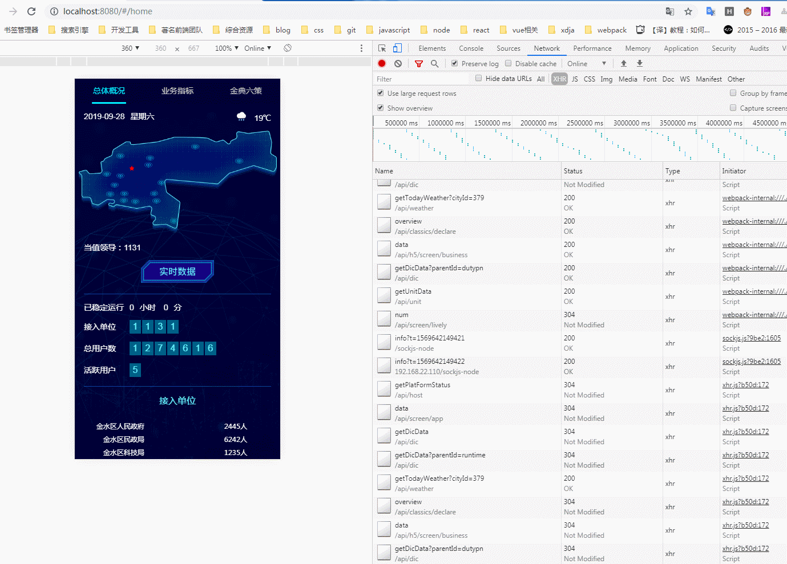
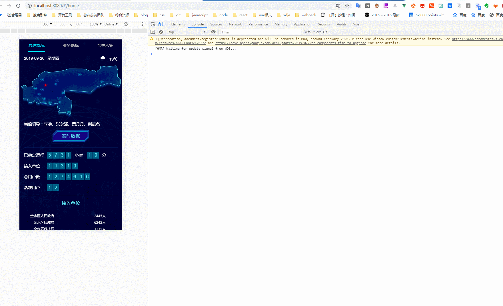

# 为移动端增加一个骨架屏（vue 实现）

在做移动端图表项目的时候，虽然 echarts 已经按需加载了，但是首次加载还是有那么几秒的白屏，思索再三，决定拿出来我以前研究的骨架屏，给它加上，接下来说下白屏的原因以及如何给项目添加一个骨架屏

## 白屏的原因

说到白屏的原因不得不说下浏览器的渲染原理。看张图


解析过程大概分为下面一些过程：

- FP（First Paint）：首次绘制，标记浏览器渲染任何在视觉上不同于导航前屏幕内容的时间点
- FCP（First Contentful Paint）：首次内容绘制，标记的是浏览器渲染第一帧内容 DOM 的时间点，该内容可能是文本、图像、等
- FMP（First Meaning Paint）：首次有效绘制，标记主角元素渲染完成的时间点

由上可见 FP，FCP 对我们来说都是白屏，只有到了 FMP 才是可用的，接下来说下 vue 项目

- 等待 HTML 文档返回，此时处于白屏状态
- 对 HTML 文档解析完成后进行首屏渲染，白屏 因为 app 节点里啥都没有
- 进行文件加载、JS 解析等过程，白屏 vue 项目主要消耗的时间。
- 当 Vue 实例触发了 mounted 后，页面开始出现内容。
- 所有请求完成后完整的页面呈现。

## 骨架屏原理

而骨架屏的原理就是将页面的布局结构注入到 app 节点内，然后在 mounted 之前页面就会一直显示骨架屏，直到 mounted 后替换节点内容
未加骨架屏的时候 dom 结构是这样的

```html
<!DOCTYPE html>
<html lang="en">
  <head> </head>
  <body>
    <noscript>
      <strong
        >We're sorry but vant-rem doesn't work properly without JavaScript
        enabled. Please enable it to continue.</strong
      >
    </noscript>
    <div id="app"></div>
    <!-- built files will be auto injected -->
  </body>
</html>
```

app 节点里啥都没有，而加了骨架屏 dom 节点大概是这样的

```html
<!DOCTYPE html>
<html lang="en">
  <head> </head>
  <body>
    <noscript>
      <strong
        >We're sorry but vant-rem doesn't work properly without JavaScript
        enabled. Please enable it to continue.</strong
      >
    </noscript>
    <div id="app">
      <div
        id="skeleton1"
        class="skeleton1-wrapper"
        style="height:100%;overflow:hidden;display:none;"
      >
        
      </div>
    </div>
    <!-- built files will be auto injected -->
  </body>
  ...
</html>
```

app 节点里有了一个图片来显示页面的大致结构，这样 mounted 之前页面就会一直显示骨架屏图片

效果对比如下

加了骨架屏之后是这样的


可以看到首屏 mounted 之前页面显示的是骨架屏。这个项目后面没有直接出来页面结构主要是因为 mounted
之后，页面挂载了太多的图片和图标，这时候图片还没加载完成，图表的数据是请求获取过来的。这一部分时间骨架屏就做不到了，毕竟
不知道图片啥时候加载完，请求啥时候完成返回数据，可以通过其他方式优化

## 实现骨架屏

骨架屏的实现方式也多种多样，简单介绍下

1. 手写 HTML、CSS 的方式为目标页定制骨架屏，写在 public/index.html app 节点里面（费时费力）
2. page-skeleton-webpack-plugin 自动生成并自动插入静态骨架屏，可惜这种方式只支持 history 模式还只有首屏
3. vue-skeleton-webpack-plugin 这个倒是可以自动注入到 app 节点内，但是注入的内容还是要前端实现（可以一张图片），所以交给 ui 吧。

权衡利弊个业务还是第三种方式最合适，下面开始实现
安装：

```bash
npm install vue-skeleton-webpack-plugin
```

编写骨架屏

```HTML
<!-- skeleton/skeleton1.vue -->
<template>
  <div style="height:100%;overflow:hidden;">
    
  </div>
</template>

```

```HTML
<!-- skeleton/skeleton2.vue -->
<template>
  <div >另一个骨架屏</div>
</template>
```

骨架屏配置文件

```javascript
import Vue from "vue";
import Skeleton1 from "./Skeleton1.vue";
import Skeleton2 from "./Skeleton2.vue";

export default new Vue({
  components: {
    Skeleton1,
    Skeleton2
  },
  //render: h => h(Skeleton1,Skeleton2),
  template: `
       <div style='height: 100%;'>
           <skeleton1 id="skeleton1" style="display:none"/>
           <skeleton2 id="skeleton2" style="display:none"/>
       </div>
    `
});
```

随后在 cli3 中引入插件并配置

```javascript
//vue.config.js
const SkeletonWebpackPlugin = require("vue-skeleton-webpack-plugin");
module.exports = {
  publicPath: "./",
  assetsDir: "android",
  indexPath: "index_android.html",
  productionSourceMap: false,
  chainWebpack: config => {
    config.resolve.alias
      .set("@mock", resolve("mock"))
      .set("@assets", resolve("src/assets"));
    // 这里只写了两个个，你可以自己再加，按这种格式.set('', resolve(''))
  },

  configureWebpack: config => {
    config.plugins.push(
      new SkeletonWebpackPlugin({
        webpackConfig: {
          entry: {
            app: path.join(__dirname, "./src/skeleton/entry-skeleton.js") //这里为上面的entry-skeleton.js
          }
        },
        minimize: true,
        quiet: true,
        router: {
          mode: "hash",
          routes: [
            {
              path: "/home", //和router.js中的路径一样就行
              skeletonId: "skeleton1" //之前的id
            },
            {
              path: "/demo",
              skeletonId: "skeleton2"
            }
          ]
        }
      })
    );
    if (process.env.NODE_ENV == "production") {
      config.plugins.push(
        new FileManagerPlugin({
          onEnd: {
            archive: [{ source: "./dist", destination: "./dist/dist.zip" }]
          }
        })
      );
    }
    if (process.env.use_analyzer) {
      config.plugins.push(new BundleAnalyzerPlugin());
    }
  }
};
```

这样一个简单的骨架屏就完成了，下面是加骨架屏前后的展示形式对比
未加骨架屏

加了骨架屏之后是这样的


按理来说这样在移动端首次加载的时候骨架屏就会替换白屏，但是在 oa 中由于终端对 webView 做了处理，
直接用一个 loading 把骨架屏干掉了。所以 oa 中使用还需要终端把这个 loading 去掉，但是 oa 中 H5 应用挺多直接去掉其他的都会是白屏
思考了下，可以在管理平台建应用的时候增加一个配置项是否有骨架屏，有的话终端就不用 loading，没有的话就依然保持现在的 loading

## 代码地址

```bash
# 克隆项目
git clone git@gitlab.idc.safecenter.cn:lal/jsdata-mobile.git

# 进入项目目录
cd jsdata-mobile

# 建议不要用 cnpm 安装 会有各种诡异的bug 可以通过如下操作解决 npm 下载速度慢的问题
npm config set registry https://registry.npm.taobao.org

# 安装依赖
npm install

# 跑服务
npm run serve

```

可以通过以上操作查看这个项目
::: tip
强烈建议不要用直接使用 cnpm 安装，会有各种诡异的 bug ，我已经很久没用过 cnpm 了，可以通过重新指定 registry 来解决 npm 安装速度慢的问题。

Windows 用户若安装不成功（大家基本都是），很大概率是`node-sass`安装失败，[解决方案](http://192.168.9.116:8090/pages/viewpage.action?pageId=9424363)。

:::

## 目录结构

```tree
├─.browserslistrc ---------- // 浏览器配置
├─.eslintrc.js ------------- // eslint配置
├─.gitignore --------------- // git忽略文件
├─babel.config.js ---------- // babel 插件配置
├─mock --------------------- // 数据mock
├─package-lock.json
├─package.json
├─postcss.config.js -------- // postcss 配置
├─public
│ ├─favicon.ico
│ ├─images
│ └─index.html
├─src
│ ├─App.vue
│ ├─assets
│ │ ├─css
│ │ │ ├─main.scss
│ │ │ ├─mixin.scss
│ │ │ ├─transition.scss
│ │ │ ├─_global.scss
│ │ │ └─_variable.scss
│ │ ├─font
│ │ ├─img
│ │ ├─json
│ │ └─logo.png
│ ├─components
│ │ └─HelloWorld.vue
│ ├─fetch
│ │ ├─excelDownload.js ----- // excel文件下载函数
│ │ ├─index.js ------------- // api接口管理入口
│ │ └─instance.js ---------- // axios实例化
│ ├─filters
│ │ └─index.js ------------- // 全局过滤器
│ ├─lib -------------------- // 第三方插件库
│ │ ├─eoa.js
│ │ └─initEcharts.js ------- // 初始化echarts配置
│ ├─main.js ---------------- // app入口文件
│ ├─router.js
│ ├─skeleton --------------- // 骨架屏
│ │ ├─entry-skeleton.js ---- // 骨架屏入口
│ │ ├─home.vue
│ │ └─demo.vue
│ ├─store.js
│ ├─utils ------------------ // 工具函数
│ │ └─dom.js --------------- // dom操作
│ └─views
│   ├─demo.vue
│   └─Home.vue
└─vue.config.js
```

## 问题及注意事项

- 骨架屏的文件和配置项入口均存放位置在 src/skeleton 文件夹下
- 实际应用中骨架屏的 id 命名与路由的命名保持一致，模式选择 hash
- 骨架屏的图片由 ui 实现，这里不考虑前端实现（复杂的前端很难实现，比如上面的地图）

  其实可以写 dom 来当做骨架屏内容，不过这种方式有点慢

- 由于骨架屏的原理原因，所以路由跳转的时候是不会有骨架屏的，但是刷新的时候有

  如果想路由跳转的时候也有骨架屏，那么骨架屏就不要挂载在 app 内，新建一个 dom 节点。然后手动去控制消失。至于刷新，oa 中好像没有刷新的操作入口

- vue mounted 之后页面为啥会闪一下

  mounted 之后 vdom 会转换为 dom 挂载在 app 内，如果挂载的 dom 有太多的资源需要加载（一般是图片），这里用了太多的图片，导致闪了一下。

  如何解决？，可以在 mounted 之后，加一个和骨架屏一样的图片，然后过会再让他消失。

- 终端来做骨架屏？

  其实是可以的，oa 中现在的 loading 图标，换成一个骨架屏图片，理论上是可行的。
