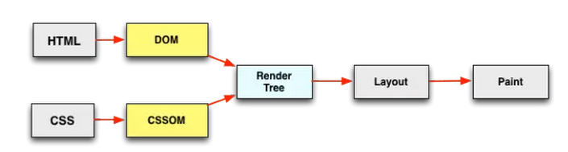

# 为移动端增加一个骨架屏（vue 实现）

在做移动端图表项目的时候，虽然 echarts 已经按需加载了，但是首次加载还是有那么几秒的白屏，思索再三，决定拿出来我以前研究的骨架屏，给它加上，接下来说下白屏的原因以及如何给项目添加一个骨架屏

## 白屏的原因

说到白屏的原因不得不说下浏览器的渲染原理。看张图



解析过程大概分为下面一些过程：

- FP（First Paint）：首次绘制，标记浏览器渲染任何在视觉上不同于导航前屏幕内容的时间点
- FCP（First Contentful Paint）：首次内容绘制，标记的是浏览器渲染第一帧内容 DOM 的时间点，该内容可能是文本、图像、等
- FMP（First Meaning Paint）：首次有效绘制，标记主角元素渲染完成的时间点

由上可见 FP，FCP 对我们来说都是白屏，只有到了 FMP 才是可用的，接下来说下 vue 项目

- 等待 HTML 文档返回，此时处于白屏状态
- 对 HTML 文档解析完成后进行首屏渲染，白屏 因为 app 节点里啥都没有
- 进行文件加载、JS 解析等过程，白屏 vue 项目主要消耗的时间。
- 当 Vue 实例触发了 mounted 后，页面开始出现内容，请求完成后完整的页面呈现。

而骨架屏的原理就是将页面的布局结构注入到 app 节点内，然后在 mounted 之前页面就会一直显示骨架屏，直到 mounted 后替换节点内容
未加骨架屏的时候是这样的

加了骨架屏之后是这样的


可以看到 FCP 到 FMP 之间的内容由白屏变成了骨架屏

## 实现骨架屏

骨架屏的实现方式也多种多样，简单介绍下

1. 手写 HTML、CSS 的方式为目标页定制骨架屏，写在 public/index.html app 节点里面（费时费力）
2. page-skeleton-webpack-plugin 自动生成并自动插入静态骨架屏，可惜这种方式只支持 history 模式还只有首屏
3. vue-skeleton-webpack-plugin 这个倒是可以自动注入到 app 节点内，但是注入的内容还是要前端实现（可以一张图片），所以交给 ui 吧。

权衡利弊个业务还是第三种方式最合适，下面开始实现
安装：

```bash
npm install vue-skeleton-webpack-plugin
```

编写骨架屏

```HTML
<!-- skeleton/skeleton1.vue -->
<template>
  <div style="height:100%;overflow:hidden;">
    
  </div>
</template>

```

```HTML
<!-- skeleton/skeleton2.vue -->
<template>
  <div >另一个骨架屏</div>
</template>
```

骨架屏配置文件

```javascript
import Vue from "vue";
import Skeleton1 from "./Skeleton1.vue";
import Skeleton2 from "./Skeleton2.vue";

export default new Vue({
  components: {
    Skeleton1,
    Skeleton2
  },
  //render: h => h(Skeleton1,Skeleton2),
  template: `
       <div style='height: 100%;'>
           <skeleton1 id="skeleton1" style="display:none"/>
           <skeleton2 id="skeleton2" style="display:none"/>
       </div>
    `
});
```

随后在 cli3 中引入插件并配置

```javascript
//vue.config.js
const SkeletonWebpackPlugin = require("vue-skeleton-webpack-plugin");
module.exports = {
  publicPath: "./",
  assetsDir: "android",
  indexPath: "index_android.html",
  productionSourceMap: false,
  chainWebpack: config => {
    config.resolve.alias
      .set("@mock", resolve("mock"))
      .set("@assets", resolve("src/assets"));
    // 这里只写了两个个，你可以自己再加，按这种格式.set('', resolve(''))
  },

  configureWebpack: config => {
    config.plugins.push(
      new SkeletonWebpackPlugin({
        webpackConfig: {
          entry: {
            app: path.join(__dirname, "./src/skeleton/entry-skeleton.js") //这里为上面的entry-skeleton.js
          }
        },
        minimize: true,
        quiet: true,
        router: {
          mode: "hash",
          routes: [
            {
              path: "/home", //和router.js中的路径一样就行
              skeletonId: "skeleton1" //之前的id
            },
            {
              path: "/demo",
              skeletonId: "skeleton2"
            }
          ]
        }
      })
    );
    if (process.env.NODE_ENV == "production") {
      config.plugins.push(
        new FileManagerPlugin({
          onEnd: {
            archive: [{ source: "./dist", destination: "./dist/dist.zip" }]
          }
        })
      );
    }
    if (process.env.use_analyzer) {
      config.plugins.push(new BundleAnalyzerPlugin());
    }
  }
};
```

这样一个简单的骨架屏就完成了，下面是加骨架屏前后的展示形式对比
未加骨架屏

加了骨架屏之后是这样的

