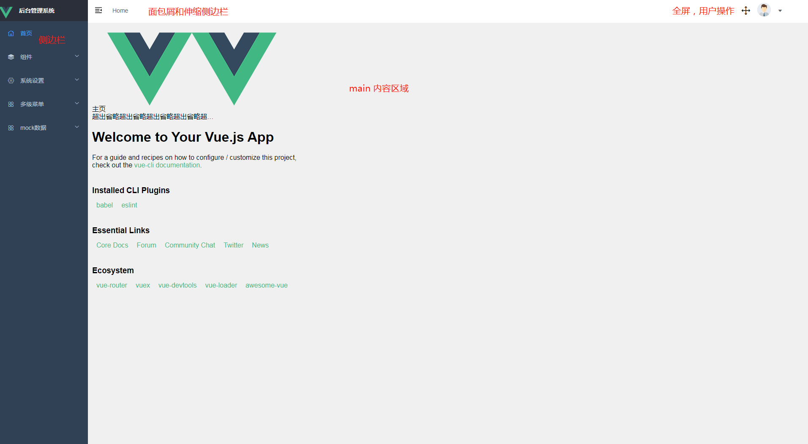

# 布局

## layout



vue-manager 点击侧边导航的页面都是基于这个 layout 的，除了个别页面如：login , 404, 401 等页面没有使用该 layout。如果你想在一个项目中有多种不同的 layout 也是很方便的，只要在一级路由那里选择不同的 layout 组件就行。

```javascript
  //
    {
      path: "/",
      // 使用layout布局
      component: Layout,
      redirect: "/home",

      //children中的路由都会在主内容区域
      children: [
        {
          path: "/home",
          component: _import("Home"),
          name: "home"
        }
      ]
    },

    // nestedRouter,
    // componentsRouter,
    // settingRouter,
    mockRouter,
    // 登陆和 login 没用layout
    {
      path: "/404",
      name: "404",
      component: _import("404"),
      meta: {
        title: "404"
      }
    },
    {
      path: "/login",
      name: "login",
      component: _import("Login")
    }
```

这里使用了 vue-router [路由嵌套](), 所以一般情况下，你增加或者修改页面只会影响 主体区域。其它配置在 `layout` 中的内容如：侧边栏或者导航栏都是不会随着你主体页面变化而变化的。

## 主内容区域

```html
<div class="content">
  <!-- 路由内容区域 -->
  <transition name="fade-transform" mode="out-in">
    <keep-alive :include="tagsList">
      <router-view></router-view>
    </keep-alive>
  </transition>
</div>
```

这里在 `router-view` 外部包了一层 `keep-alive` 和 `transition`
`keep-alive`主要是为了缓存 `<router-view>` 的，`transition`主要定义切换路由时的动画，具体的代码实现在 `assets/css/transition.scss`下，如果想使用其他的可以在这个文件下定义动画，在`layout`书写调整对应的 `name`
