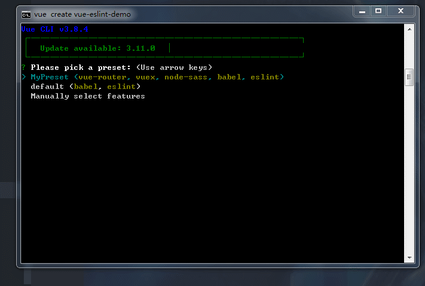

# ESLint

不管是多人合作还是个人项目，代码规范都是很重要的。这样做不仅可以很大程度地避免基本语法错误，也保证了代码的可读性。而 vue 在开发环境下，默认使用 prettier 格式化编译后的模板渲染代码，以方便调试。所以我们也在开发环境下使用 [prettier](https://prettier.io/) 风格的代码格式

## 项目使用 ESLint

在创建项目的时候直接选择使用 eslint，下面是创建项目的演示



创建完之后文件目录为：

```tree
├─.browserslistrc
├─.eslintrc.js
├─.gitignore
├─babel.config.js
├─package-lock.json
├─package.json
├─postcss.config.js
├─public
│ ├─favicon.ico
│ └─index.html
├─README.md
└─src
  ├─App.vue
  ├─assets
  │ └─logo.png
  ├─components
  │ └─HelloWorld.vue
  ├─main.js
  ├─router.js
  └─views
    ├─About.vue
    └─Home.vue
```

其中.eslintrc.js 文件就是 ESLint 代码校验规则，内容为

```js
module.exports = {
  root: true,
  env: {
    node: true
  },
  extends: ["plugin:vue/essential", "@vue/prettier"],
  rules: {
    "no-console": process.env.NODE_ENV === "production" ? "error" : "off",
    "no-debugger": process.env.NODE_ENV === "production" ? "error" : "off"
  },
  parserOptions: {
    parser: "babel-eslint"
  }
};
```

我们直接使用默认的规则就行了

然后写代码的时候就会直接提示错误和警告

## vscode 配置 ESLint

上面的 gif 图也说明了好的配置可以节省我们手动修复不规范的代码，本人使用的是 vscode 编辑器来写前端代码，通过插件配置，有种飞一般的体验。ws 和 idea 有同样的插件


上面的 gif 图红色下划线提示的错误说声明了但未使用，黄色的警告说的是在=前后加空格，因为我配置了 eslint 保存按照 prettier 风格自动修复所以 = 前后加了空格。
配置需要下面几个插件 eslint + vetur + prettier

- vetur vue 文件语法高亮，代码格式化等
- prettier 代码格式化 替代 vetur 默认配置，和创建 vue 项目时保持一致
- eslint 代码校验错误提示等 红线和黄线就是它干的
  然后自定义配置如下

```json
"eslint.validate": [
    "javascript",
    "javascriptreact",
    "vue"
]
"eslint.alwaysShowStatus": true,
"eslint.autoFixOnSave": true,
```

这样就可以按照 prettier 代码风格自动修复了。
