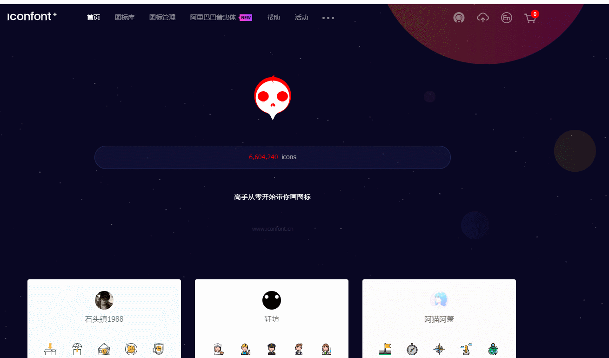

# 图表和图标

## echarts 图表

管理后台图表也是常见得需求反正我做的项目里面都有图表（可能是一有图表项目就找我）。这里图表就只推荐使用 ECharts，不要用其他的，也不要用社区对于 echarts 封装的 vue 组件。

ECharts 支持 webpack 引入，图省事可以将 ECharts 整个引入 const echarts = require('echarts') 不过 ECharts 还是不小的，所以还是建议采用按需加载的方式使用。echarts 官网给出了[按需加载](https://www.echartsjs.com/zh/tutorial.html#%E5%9C%A8%20webpack%20%E4%B8%AD%E4%BD%BF%E7%94%A8%20ECharts) 的方式;

```js
// 引入 ECharts 主模块
var echarts = require("echarts/lib/echarts");
// 引入柱状图
require("echarts/lib/chart/bar");
// 引入提示框和标题组件
require("echarts/lib/component/tooltip");
require("echarts/lib/component/title");
```

也可以使用 es6 导入方式

```js
import echarts from "echarts/lib/echarts";
import "echarts/lib/chart/bar";
import "echarts/lib/chart/line";
import "echarts/lib/component/tooltip";
```

这种方式还可以只是写的代码多，这里推荐使用另一种按需加载的方式，[babel-plugin-equire](https://www.npmjs.com/package/babel-plugin-equire)

```js
const echarts = equire([
  // 写上你需要的
  "bar",
  "legend",
  "title",
  "line",
  "tooltip",
  "grid",
  "axisPointer",
  "pie"
]);

export default echarts;
```

这个插件会自动帮我们转化为上面的形式

具体实现见[echarts 按需加载](http://192.168.9.116:8090/pages/viewpage.action?pageId=16848673)

## icon 字体图标

后台管理系统少不了小图标，以前都是图片，现在就建议使用字体图标，可以到 [iconfont.cn](https://www.iconfont.cn/)上直接搜对应的图标使用，如果是 ui 设计的，可以直接要 svg 文件制作成字体图标（这里就不说如何制作的了）

下载后放在 src/assets/font 目录下然后直接使用就行了。至于 svg 这种多色图标大概率用不到
