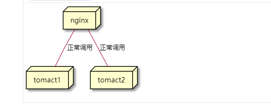

# 前后端分离部署的思考与实践

事件的起因要追溯到陈臣突然给我发的一条消息，大概意思是，注意啊，这次新做系统前后端分离了，统一数据中心这。收到这条消息我不禁陷入了深深的思考
终于要紧跟时代的发展采用 nginx 独立部署前端应用了吗，docker 在火速发展，devOps 也是，前后端独立部署之后，这些都能应用在前端中

## nginx 部署的好处

1. 从 Nginx 访问静态资源比从 Tomcat 访问要更快速，毕竟前端文件都是静态资源，nginx 作为高性能的 web 服务器几乎是前端部署的必选
2. 减少后端服务器的并发/负载压力。除了接口以外的其他所有 http 请求全部转移到前端 nginx 上，接口的请求调用 tomcat
3. 天然支持跨域，因此可以前端一个应用调用不同的服务接口，这个场景在公司中还是比较常见的，集中管控中就遇到过

集中管控中的大屏数据调用的是 mdm 服务的接口，而众所周知，浏览器发起的请求肯定会报跨域不能访问，不使用 nginx，要 mdm 改后台代码支持跨域访问这样成本就比较高了，更有甚着，如果第三方服务后台不该代码，不支持跨域那前端只能使用 jsonp 这种方式。这种场景前段时间辛柳刚遇到过。

前后端一起部署，调用另一个应用接口


nginx 部署前端资源，调用另一个应用接口



4. 即使后端服务器暂时超时或者宕机了，前端页面也会正常访问，只不过数据显示不出来而已。

5. 开启 gzip 压缩

**js 压缩了 3 倍**


**css 压缩了 5 倍**


这对于文件的加载速度优化是很大的，特别是在移动端上

6. nginx 支持热部署，不用重启服务器，前端无缝升级。

7. 各自的发布流程互不影响，可以通过一些手段（比如 git 的 CI）实现自动化部署

现在的开发流程有个问题就是如果是前端逻辑有误，而后端逻辑正常的话，前端还需要等待后端把前端代码打到 war 包里发包，然后重启服务
最常见的一种情况就是后台想本地跑服务，拿到前端代码后还要重新启动服务，而使用 nginx 这些问题将不再是问题

以上这些是我了解到或者经历的，当然 nginx 还有很多其他的优点 后台肯定比前端了解的更多

## 独立部署实践

以往用 jq 开发前端单页面应用的时候，都在电脑上装过 nginx 来开发，而实际部署中的配置可以说是完全一样了。
大致只需要三步就可以完成部署

1. 服务器下载 nginx
2. 将前端打包后的代码放在服务器 nginx 某个文件夹下
3. 书写配置文件，启动 nginx 服务

这里直接把配置文件贴出来

```bash

user nginx;
worker_processes 1;

error_log /var/log/nginx/error.log warn;
pid /var/run/nginx.pid;


events {
    worker_connections 1024;
}


http {
    include /etc/nginx/mime.types;
    default_type application/octet-stream;

    log_format main '$remote_addr - $remote_user [$time_local] "$request" '
    '$status $body_bytes_sent "$http_referer" '
    '"$http_user_agent" "$http_x_forwarded_for"';

    access_log /var/log/nginx/access.log main;

    sendfile on;
    #tcp_nopush     on;

    keepalive_timeout 65;

    gzip on;
    gzip_types text/plain application/x-javascript application/javascript text/css application/xml text/javascript application/x-httpd-php image/jpeg image/gif image/png;
    include /etc/nginx/conf.d/*.conf;
    # root /etc/nginx/html;
    server {
        listen 9527;
        server_name localhost;

        #charset koi8-r;
        access_log /var/log/nginx/host.access.log main;
        error_log /var/log/nginx/error.log error;

        # redirect index.html
        location / {
            # /etc/nginx/html 前端的静态资源放在这个文件夹下，
            #当访问/根路径的时候就加载这个文件夹下的index.html
            root /etc/nginx/html;
            gzip on; #开启gzip 压缩
            gzip_types text/plain application/x-javascript application/javascript text/css application/xml text/javascript application/x-httpd-php image/jpeg image/gif image/png;
            index index.html index.htm;
            try_files $uri $uri/ /index.html;

        }

        # proxy_pass
        location /api {
            #rewrite  /api/(.*)  /$1  break;
            proxy_pass http://11.12.97.57:8888/api;
        }

        location /public {
            #rewrite /public/(.*) /$1 break;
            proxy_pass http://11.12.97.57:8888/public;

        }
        #error_page  404              /404.html;

        # redirect server error pages to the static page /50x.html
        error_page 500 502 503 504 /50x.html;
        location = /50x.html {
            root /usr/share/nginx/html;
        }
    }
}


```

目前项目已经在内网正常跑了 http://11.12.95.204:9527/login

## 独立部署对前端的影响

前端资源独立部署后对前端的要求更高了，需要大家了解 nginx 相关的知识。对产品的流程有更深入的认识（这块我认为很有必要）

1. 拓宽前端的知识面
2. 对后续前端基础建设具有重要意义，例如：公司 docker 技术落地后，前端也可以思考 docker 容器化部署
3. 直接前端执行 npm 命令就部署到服务器，或者写个 shell 脚本。作为前端开发者不要只看前端技术。

## 对前端团队的思考

### 公司前端现状

目前公司前端人员接近 20 人，最多的还是写业务代码，但是前端团队的基础建设却步步维艰，印象最深的是 jenkins 打包，前端却要本地打包另外再维护一个 git 仓库 前端独立部署后可以慢慢改进前端的研发流程.深刻意识到作为前端不能只看前端技术，类似 Jenkins docker 之类的都能对前端的研发流程带来好处。这种状态个人感觉并不好。

### 对于前端团队的建议

团队人员少的时候大家都忙于写业务，人逐渐变多了，大家还是在忙于写业务，个人觉得应该加强前端的基础建设，例如业务组件库，开发流程优化等。
以此思考了以下一些问题。为什么人多了，大家还是在忙于业务，如果业务量增长 几 倍的情况下研发团队规模也扩充 几 倍，如果是 10 倍，难道要找 100 个人。如果我们有提高研发效率的基础建设，是不是就可以快速完成业务。但是

1. 目前公司没有基建团队，在基建和业务之间如何抉择。
2. 如果做基建，基建的时间如何安排
3. 基建意识比较弱的同学如何在项目中去培养这种意识，或者说如何鼓励团队中喜欢做业务的童鞋，多思考一些基建的工作
4. 基建项目如何立项，先做什么，后做什么，哪些能给前端团队带来快速的收益，例如提高开发效率
5. 做基建需要学习具备哪些知识？
   需要团队具备后端和运维相关的知识沉淀，例如，做持续集成，肯定会涉及到运维的知识，以及相关后台知识，这样才能和这些技术栈的角色更好的交流和合作。而只有前后端分离部署，前端才能确切的接触到这些知识，

以上只是一些思考，具体应该如何落地还需要进一步的思考与实践。
这次统一数据中心的部署方式个人强烈建议前后端分离部署，对于前端后续的基建工作具有很强的意义

http://gitlab.idc.safecenter.cn/api/v4/projects/1695/repository/tags
